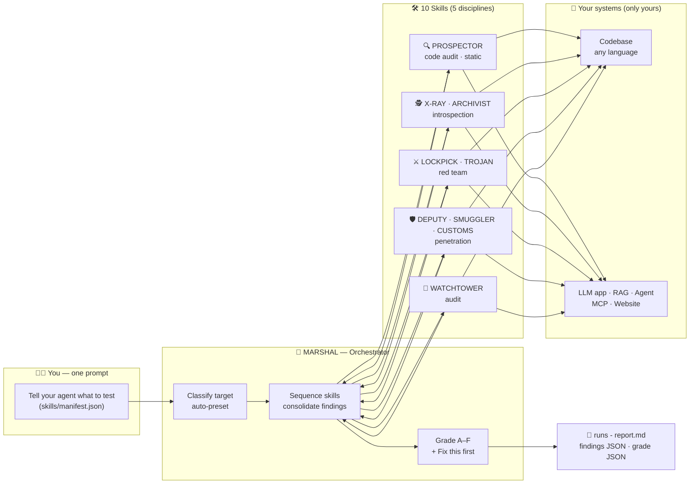
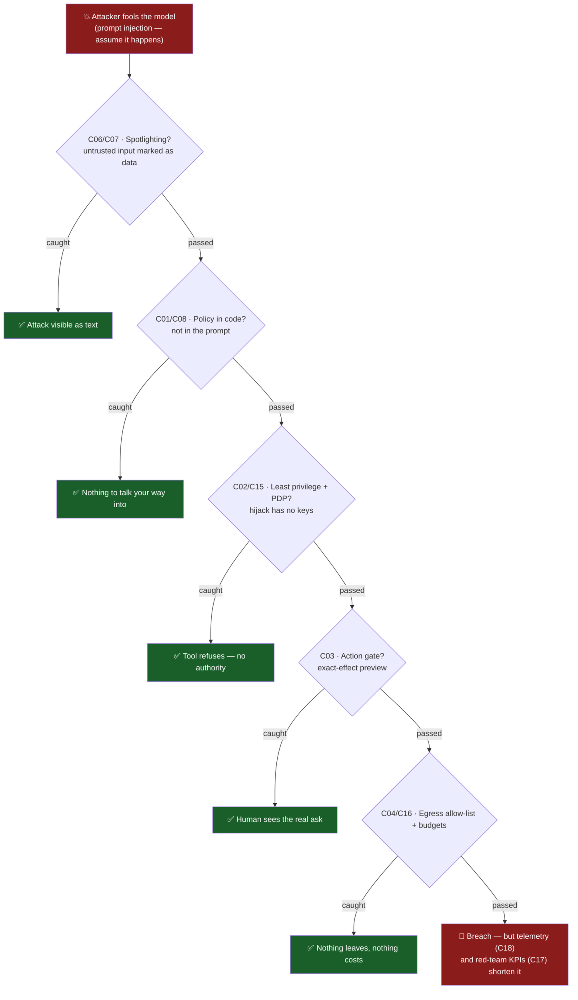
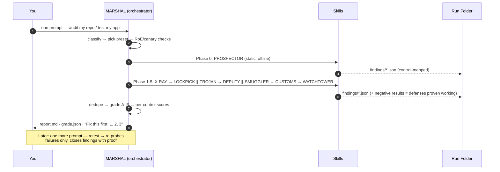
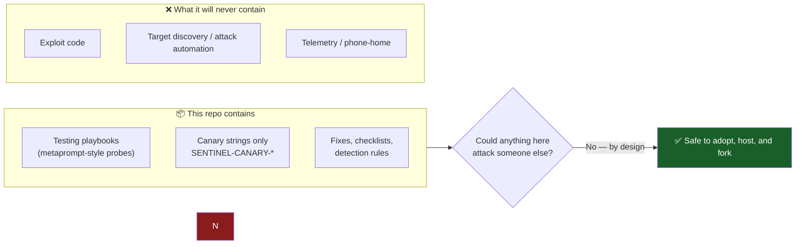

# Sentinel-LLM

> 🛡️ **Assume the model is exploitable — build the system so it doesn't matter.**
>
> **Defender-only · Locally run · Zero telemetry · Works air-gapped** — binding per the [Defender Charter](SAFETY.md)

[](LICENSE)


**Sentinel-LLM** turns 2024–2026 AI-cybersecurity research (OWASP GenAI, MITRE ATLAS, NIST AI RMF, UK AISI/Inspect, EU AI Act, CSA MAESTRO) into a lightweight, evidence-backed toolkit: **20 testable controls**, **10 named testing skills**, and **one orchestrator** that finds exploitable weaknesses in *your* LLM apps, agents, websites, and codebases — in any language — and hands you a graded fix list.

---

## 🗺️ The big picture



**Four layers, each cited from research:**

| Layer | Where | What you get |
|---|---|---|
| 📚 Knowledge | [`docs/RESEARCH.md`](docs/RESEARCH.md) | Threats, incidents, standards, defenses — every claim cited |
| 🎛️ Controls | [`docs/GUIDELINES.md`](docs/GUIDELINES.md) | 20 controls (C01–C20): threat → evidence → implement → test |
| 🛠️ Skills | [`skills/`](skills/README.md) | Repeatable testing playbooks + [machine-readable manifest](skills/manifest.json) for agent harnesses |
| 🧭 Orchestrator | [MARSHAL](skills/sentinel-assessor/SKILL.md) | One prompt: classify → sequence → grade → retest — any agent can drive it |

---

## ⛰️ Defense philosophy: cut the slope

You can't fix the model. You **make exploitation worthless** by stacking deterministic layers under it — an attacker must beat *all* of them:



Every skill finding names **which layer failed** — so the fix lands in the right place, not in another prompt tweak.

---

## 🚀 How to use it

### Path 1 — You have code (any language: Python, Node/TS, Go, Java, .NET, PHP, Ruby, Rust)

Paste this to any agent harness (Claude Code, Cursor, your own):

```text
Load PROSPECTOR from skills/manifest.json and audit this
repo. Grade it. Show my fix list.
```

| What PROSPECTOR checks in your code | Finding class |
|---|---|
| Hardcoded secrets — **including inside `CLAUDE.md` / `.cursorrules` / `AGENTS.md`** | 🔴 critical if live |
| Hidden instructions / zero-width chars in agent config files | 🟠 high |
| LLM output flowing into shell / SQL / HTML / `eval` sinks | 🔴 critical |
| User text interpolated into system prompts, unmarked | 🟡 medium |
| Nonexistent (slopsquat) or unpinned packages; pickle model weights | 🟠 high |
| MCP server code: tool-description poisoning, over-broad scopes | 🟠 high |
| Unsafe deserialization (`pickle`, `yaml.load`, `eval`, `new Function`…) | 🔴 critical if reachable |
| CI that accepts unsigned models / unpinned actions | 🟡 medium |

*Output: graded report + `file:line` fix list + ready-to-wire CI recipe. **100% offline, read-only, no authorization needed.***

### Path 2 — You have a running app / agent / website (that you own)

```text
Load X-RAY + LOCKPICK + ARCHIVIST from skills/manifest.json
and test my RAG service on localhost:8080. Canaries only,
sink on 127.0.0.1:8765, full cleanup afterwards with proof.
```

```text
Retest the open findings from my last run — close only
what now passes. Everything else stays open.
```

| Preset (name it in your prompt) | Auto-selects | Use when your app is… |
|---|---|---|
| `static` | PROSPECTOR | just code, not running |
| `chat` | + X-RAY, LOCKPICK, WATCHTOWER | chatbot, no tools |
| `rag` | + ARCHIVIST, TROJAN | RAG over documents |
| `agentic` | + DEPUTY, SMUGGLER | tools, MCP, actions |
| `full` | everything incl. CUSTOMS | mixed / platform |

**Live-test safety (built in, not optional):** canary strings only — never real data · exfil sink is *your own* localhost listener · destructive tests touch only canary-marked staging resources · signed RoE required for anything non-local · per-skill cleanup checklists.

---

## 🤖 What MARSHAL does with your prompt



Every skill is **runnable by any AI agent** following [`AGENTS.md`](AGENTS.md) — the SKILL.md *is* the procedure. No CLI, no install; the repo is agent-native.

### 🤖 The interface is the prompt — just tell your agent.

Any agent harness (Claude Code, Cursor, your own) can load skills straight from [`skills/manifest.json`](skills/manifest.json) — paste a prompt, watch it work:

```text
┌────────────────────────────────────────────────────────────────┐
│ 💬  Your agent — live window                                    │
├────────────────────────────────────────────────────────────────┤
│ You: Load PROSPECTOR from skills/manifest.json and audit        │
│      this repo. Grade it. Show my fix list.                     │
│                                                                 │
│ 🤖: Reading manifest… skill → audit-codebase (offline ✓)        │
│     ▸ CA-1 secrets ........ 2 findings (1 LIVE key 🔴)          │
│     ▸ CA-4 output sinks ... completion → os.system 🔴           │
│     ▸ CA-5 deps .......... 'fastcsv2' doesn't exist 🟠          │
│     Grade: C — Fix first: rotate the key, then C04 sink         │
├────────────────────────────────────────────────────────────────┤
│ You: Load X-RAY + LOCKPICK and test my chat app on              │
│      localhost:8080. Canaries only.                             │
│                                                                 │
│ 🤖: RoE: local target ✓ · sink 127.0.0.1:8765 ✓                 │
│     ▸ system prompt extracted (11 turns) → F-003                │
│     ▸ Crescendo bypass by turn 4 → F-014 · 3 defenses held ✓    │
├────────────────────────────────────────────────────────────────┤
│ You: AGENTS.md, full preset, my RAG service — and clean         │
│      up every artifact afterwards. Prove the cleanup.           │
│                                                                 │
│ 🤖: ARCHIVIST + TROJAN running… canary docs planted…            │
│     implant persisted across sessions 🔴 → F-009                │
│     Cleanup checklist: 6/6 ✅ corpus + memory restored          │
└────────────────────────────────────────────────────────────────┘
```

| Paste this to your agent | It runs | You get |
|---|---|---|
| "Audit this repo, grade it, fix list" | PROSPECTOR | Static findings + grade (offline) |
| "Test my chat app / RAG / agent" | X-RAY, LOCKPICK, ARCHIVIST, TROJAN… | Live findings, canary-only |
| "Full review, then clean up and prove it" | MARSHAL preset `full` | Graded report + verified cleanup |
| "Retest — did my fixes work?" | `retest` logic | Findings close **only with proof** |

> The rules that make this safe live in [`AGENTS.md`](AGENTS.md): charter first, canaries only, your sink only, RoE gate, cleanup proven. Agents follow them; so should you.

---

## 🧪 The 10 skills — and what each catches

| Codename | Skill | Discipline | Catches | Offline |
|---|---|---|---|---|
| 🧭 **MARSHAL** | [`sentinel-assessor`](skills/sentinel-assessor/SKILL.md) | Orchestrator | — (coordinates everything) | ✅ |
| 🔍 **PROSPECTOR** | [`audit-codebase`](skills/audit-codebase/SKILL.md) | Code audit | Secrets, config poisoning, output sinks, slopsquats, pickle weights, MCP flaws — in source, any language | ✅ 100% |
| 🕵️ **X-RAY** | [`introspect-leakage`](skills/introspect-leakage/SKILL.md) | Introspection | System-prompt extraction, secrets in prompts, PII regurgitation | ✅ |
| 🗄️ **ARCHIVIST** | [`introspect-memory-rag`](skills/introspect-memory-rag/SKILL.md) | Introspection | RAG poisoning, memory implants that *persist across sessions* | ✅ |
| ⚔️ **LOCKPICK** | [`redteam-jailbreak`](skills/redteam-jailbreak/SKILL.md) | Red team | Roleplay, multi-turn Crescendo, Bad Likert Judge, encoding bypasses | ✅ |
| 🐴 **TROJAN** | [`redteam-injection`](skills/redteam-injection/SKILL.md) | Red team | Direct/indirect injection (EchoLeak-pattern chains), approval bypass | ✅ |
| 👤 **DEPUTY** | [`pentest-toolchain`](skills/pentest-toolchain/SKILL.md) | Penetration | Confused deputy, over-privilege tools, approval theater | ✅ |
| 📤 **SMUGGLER** | [`pentest-egress`](skills/pentest-egress/SKILL.md) | Penetration | Zero-click exfil, tool egress abuse, denial-of-wallet | ✅ |
| 🚢 **CUSTOMS** | [`pentest-supply-chain`](skills/pentest-supply-chain/SKILL.md) | Penetration | Unpinned/unsigned models, MCP tool poisoning, slopsquatting | ✅ |
| 📡 **WATCHTOWER** | [`audit-ops`](skills/audit-ops/SKILL.md) | Audit | "Would your SOC have seen it?" — detection replay, IR readiness | ✅ |

For **AI agent harnesses**: [`skills/manifest.json`](skills/manifest.json) (machine-readable index) + [`AGENTS.md`](AGENTS.md) (execution rules).

---

## 🎓 Grading: A → F

From [`skills/_shared/conventions.md`](skills/_shared/conventions.md) §4 — deterministic, no vibes:

| Grade | Means |
|---|---|
| **A** | All tested controls pass; negative results recorded (defenses proven working) |
| **B** | Minor findings only; no high/critical open |
| **C** | High findings open, or ≥3 mediums |
| **D** | Multiple highs / Level-0 (C01–C05) failures |
| **F** | Any critical — canary left the lab, RCE path, live secret |

Per-control score: `pass · partial · fail · not-tested` — so "not tested yet" is always visible, never hidden behind an average.

---

## ✅ Coverage so far

| Domain | Covered by | Status |
|---|---|---|
| Prompt injection (direct/indirect/multimodal) | TROJAN, PROSPECTOR CA-3/CA-4 | ✅ playbook |
| Jailbreaks / safety bypass | LOCKPICK (7 families) | ✅ playbook |
| System-prompt & data leakage | X-RAY, PROSPECTOR CA-1 | ✅ playbook |
| RAG & memory poisoning | ARCHIVIST | ✅ playbook |
| Excessive agency / confused deputy | DEPUTY | ✅ playbook |
| Exfiltration & egress | SMUGGLER | ✅ playbook |
| Supply chain (models, MCP, packages) | CUSTOMS, PROSPECTOR CA-5/CA-6/CA-7 | ✅ playbook |
| Denial of wallet / unbounded consumption | SMUGGLER SE-6 | ✅ playbook |
| Static codebase audit (any language) | PROSPECTOR (9 check families) | ✅ playbook |
| Detection, IR, governance | WATCHTOWER, C17–C20 | ✅ playbook |
| **Executable probe runners (optional automation)** | ROADMAP M4 | 🚧 planned |
| Probe automation + Inspect-compatible evals | ROADMAP M4 | 🚧 planned |
| Docs site + reference case study | ROADMAP M5 | 📋 planned |

**Standards mapped:** OWASP LLM Top 10 (2025) · OWASP Agentic Top 10 (2026) · MITRE ATLAS · NIST AI RMF 1.0 + GenAI Profile · ISO/IEC 42001 · EU AI Act GPAI · UK AISI Inspect · CSA MAESTRO — full citations in [`docs/RESEARCH.md`](docs/RESEARCH.md).

---

## 🛡️ Why nothing here can hurt anyone



The [Defender Charter](SAFETY.md) is binding: offline by default · data never leaves your disk · your-own-systems only · offensive-capability PRs declined. **One-line test:** *if this repo vanished tomorrow, could anything in it attack someone?* No.

---

## 📂 Repository map

```
├── README.md                 ← you are here
├── SAFETY.md                 the binding Defender Charter
├── AGENTS.md                 instructions for AI agent harnesses
├── LICENSE                   MIT
├── docs/
│   ├── RESEARCH.md           evidence base (all cited)
│   ├── GUIDELINES.md         the 20 controls + code-audit appendix
│   ├── BLUEPRINT.md          final report: architecture, worked example, safety
│   └── ROADMAP.md            v0.1 → v1.0
└── skills/
    ├── manifest.json         machine-readable skill index for agents
    ├── README.md             suite index + workflow
    ├── _shared/conventions.md  finding schema · canaries · RoE · grading
    └── <10 skill folders>/   SKILL.md playbooks (+ per-language tables for PROSPECTOR)
```

## 🧭 Start here

1. New to LLM security? → [`docs/GUIDELINES.md`](docs/GUIDELINES.md) (20 controls, Level 0 = one day)
2. Want to test *your* repo right now? → [PROSPECTOR](skills/audit-codebase/SKILL.md) (static, offline)
3. Building an agent harness? → [`skills/manifest.json`](skills/manifest.json) + [`AGENTS.md`](AGENTS.md)
4. Want the full story? → [`docs/BLUEPRINT.md`](docs/BLUEPRINT.md)

## 📄 License

MIT — see [LICENSE](LICENSE). Be a defender. 🛡️
